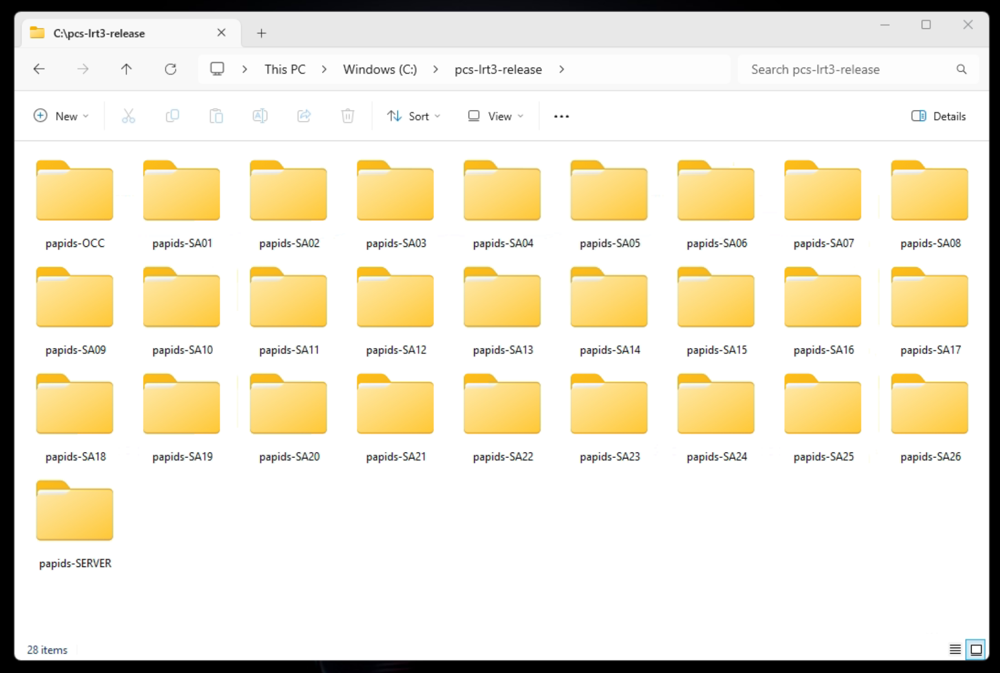

## Project Title
# LRT3-PAPIDS Web (Compiled build with docker)

## Table of Content:

- [About The App](#about-the-app)
- [Setup Files](#screenshots)
- [Installation folders](#technologies)
- [Installation Steps](#react-app-setup)

## About The Installation
LRT3-PAPIDS Front End System docker installation files for each LRT station


## Setup Files
The docker installation file is located at C:\pcs-lrt3-release location on the testing workstation in the PCS office.



## Installation folders
Each Docker installation folder consists of two docker images: one is the ping-server image and the other is the web-server image.

The ping-server image was built from the source code of ASLPingServer https://github.com/PCS-GIS-PAPIDS-Control-Software/ASLPingServer

The web-server image was built from the source code of ASL_Web https://github.com/PCS-GIS-PAPIDS-Control-Software/ASL_Web

All stations use the same ping-server image, while there are different web-server images for each station.

These Docker installation folders are the front-end web setup for the LRT station, which should be installed on the workstation of each LRT station.

## Installation Steps

1. Copy the correct folder for selected station to a folder named ```papids-web``` on root drive (C:).
2. Open the command terminal.
3. Navigate to the folder by typing ```cd c:/papids-web``` iin the command terminal.
4. Start docker installation by typing ```docker compose up -d``` in the command terminal.
5. Wait for the entire installation process to complete.


