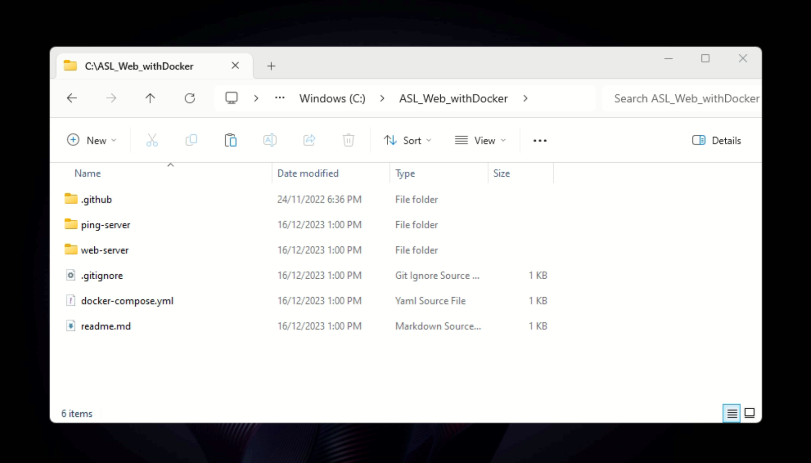

## Project Title
# LRT3-PAPIDS PIDS (Compiled build with docker)

## Table of Content:

- [About The Installation](#about-the-app)
- [Setup Files](#screenshots)
- [Installation folders](#technologies)
- [Installation Steps](#react-app-setup)

## About The Installation
LRT3-PAPIDS PIDS System docker installation files


## Setup Files
The installation folder is located at C:\pcs-lrt3-release\pids location on the testing workstation in the PCS office.



## Installation folders
The installation folder consists of bash shell files together with the docker-build folder.

This installation involves a Linux shell command setup. The shell commands trigger a Docker build, which containerizes the execution binary of the GDU service.

The docker creates a web server with a publish folder, https://github.com/PCS-GIS-PAPIDS-Control-Software/GDUSetupWithDocker/tree/main/docker-build/web-server/publish. This folder contains all the binary execution code of the GDU services.

These installation folder is the setup for the GDU units.

The OS of the GDU must be Ubuntu.

## Configuration 
The GDU system must be configured with the correct PIDS codes before running the installation commands.

The configuration file is /unit.config

Open the file with a text editor and set the correct PIDS codes e.g. <br/>
```pidCodes=("SA22-GDU001-CC-D001" "SA22-GDU001-CC-D002")``` <br/>
where ```"SA22-GDU001-CC-D001" "SA22-GDU001-CC-D002"``` are the PIDS codes.

Refer to the backend database to get the correct PIDS codes for each GDU unit.

## Installation Steps

1. Copy the correct folder for the selected station to a folder named ```papids-pids``` on the root drive.
2. Open the command terminal.
3. Navigate to the folder by typing ```ls /papids-pids``` in the command terminal.
4. Start the installation by typing ```bash install.sh``` in the command terminal.
5. Wait for the entire installation process to complete.


