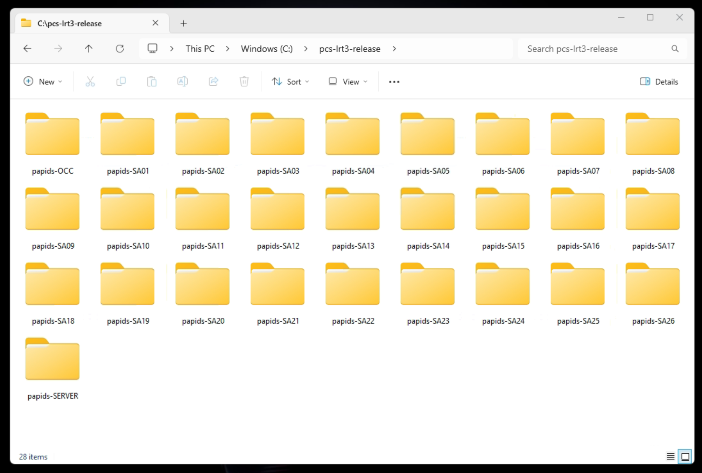

## Project Title
# LRT3-PAPIDS PIDS (Compiled build with docker)

## Table of Content:

- [About The App](#about-the-app)
- [Setup Files](#screenshots)
- [Installation folders](#technologies)
- [Installation Steps](#react-app-setup)

## About The App
LRT3-PAPIDS PIDS System docker installation files


## Setup Files
The installation folder is located in the C:\pcs-lrt3-release\pids location on the testing workstation in the PCS office.



## Installation folders
The installation folder consists of bash shell files together with docker-build folder.

This installation is a Linux shell command setup, the shell commands eventually would trigger docker build which containize the execution binary of the GDU service.

The docker creates a web server with a publish folder, https://github.com/PCS-GIS-PAPIDS-Control-Software/GDUSetupWithDocker/tree/main/docker-build/web-server/publish which consists of all the binary execution code of the GDU services.

These installation folder is the setup for the GDU.

The OS of the GDU must be Ubuntu.

## Configulation 
The GDU system must be configured with the correct PIDS codes before running the installation commands.

The configuration file is /unit.config

Open the file with text editor, set the correct PIDS codes e.g. <br/>
```pidCodes=("SA22-GDU001-CC-D001" "SA22-GDU001-CC-D002")``` <br/>
where ```"SA22-GDU001-CC-D001" "SA22-GDU001-CC-D002"``` are the PIDS codes.

Refer to the backend database to get the correct PIDS codes of each GDU units.

## Installation Steps

1. Copy the correct folder for selected station to a folder named papids-pids on root drive
2. Open the command terminal
2. Go into the folder, by typing ```ls /papids-pids``` on the command terminal
3. Start installation by typing ```bash install.sh``` on the command terminal
4. Wait to complete the whole installation process


